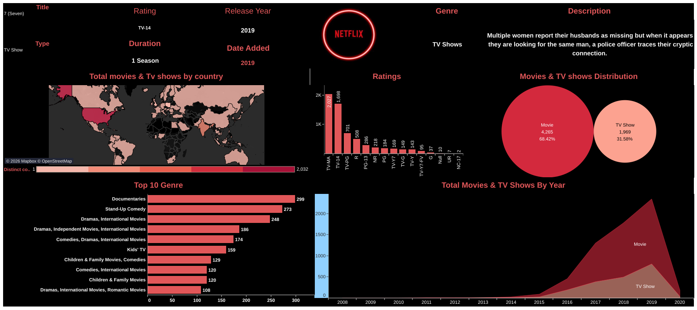

# 🎬 Netflix Content Analytics Dashboard

> An interactive Tableau dashboard designed to transform raw Netflix content data into executive-level business insights through modern data visualization and storytelling.

---

# 📸 Dashboard Preview



---

# 🌐 Live Dashboard

Explore the interactive Tableau dashboard here:

👉 **Tableau Public:**  
[](https://public.tableau.com/app/profile/kareem.watts6228/viz/NetflixDashboard_16738648853780/Dashboard1)
---

# 📌 Business Problem

Streaming platforms manage thousands of movies and television shows spanning multiple countries, genres, maturity ratings, and release years. Decision makers need an intuitive way to understand catalog composition, identify content trends, and support strategic business decisions.

Without visualization, raw datasets provide little business value. Executive dashboards help transform complex data into actionable insights that can be explored interactively.

---

# 💡 Solution

This project demonstrates how Tableau can be used to convert raw entertainment data into an executive reporting dashboard that provides visibility into:

- 🌍 Global content distribution
- 🎬 Movies vs. TV Shows
- 🎭 Genre popularity
- ⭐ Content ratings
- 📈 Release trends over time
- 🔍 Individual title details

The dashboard was designed using business intelligence and executive reporting principles with an emphasis on usability, visual storytelling, and interactive exploration.

---

# ✨ Dashboard Features

- 🌍 Interactive World Map
- 📊 Executive KPI Dashboard
- 🎬 Movie vs TV Show Distribution
- 🎭 Top 10 Genres
- ⭐ Ratings Breakdown
- 📈 Release Trends by Year
- 🔍 Interactive Title Drill-down
- 🎯 Dynamic Dashboard Filtering

---

# 📊 Business Questions Answered

This dashboard helps answer questions such as:

- Which countries contribute the most Netflix content?
- What percentage of the catalog consists of Movies versus TV Shows?
- Which genres are most common?
- How has Netflix's content library evolved over time?
- Which maturity ratings dominate the platform?
- What information is available for each individual title?

---

# 🛠 Technology Stack

- Tableau Desktop
- Tableau Public
- Business Intelligence
- Data Visualization
- Dashboard Design
- Data Storytelling

---

# 🧠 Skills Demonstrated

This project demonstrates practical experience with:

- Executive Dashboard Development
- Business Intelligence
- Interactive Analytics
- Data Visualization
- KPI Reporting
- Geographic Analysis
- Data Storytelling
- Dashboard Design

---

# 📂 Repository Structure

```text
tableau-netflix-analytics-dashboard/
│
├── README.md
│
├── dashboard/
│   └── Netflix Dashboard.twbx
│
├── docs/
│   └── screenshots/
│       └── dashboard-overview.svg
│
├── data/
│   └── netflix_titles.csv
│
└── LICENSE
```

---

# 🚀 Future Improvements

Future enhancements may include:

- Automated data refresh
- Additional executive KPIs
- Streaming platform comparisons
- Viewer engagement analytics
- Predictive trend analysis
- Enhanced dashboard interactivity
  
> **Note:** This is an independent portfolio project created for educational and demonstration purposes and is not affiliated with Netflix.
---

# 👨‍💻 About Me

**Kareem Watts**

Technical Business Analyst with experience in Cloud Governance, Cybersecurity, Business Intelligence, Data Analytics, and Process Automation.

I enjoy building data-driven solutions that help organizations improve visibility, simplify decision-making, and communicate insights effectively.

### Connect with Me

**LinkedIn**  
https://www.linkedin.com/in/kareem-watts-062623b1/

**GitHub**  
https://github.com/reemdadreem

---

⭐ If you found this project helpful or interesting, consider starring the repository.

Thanks for visiting!
